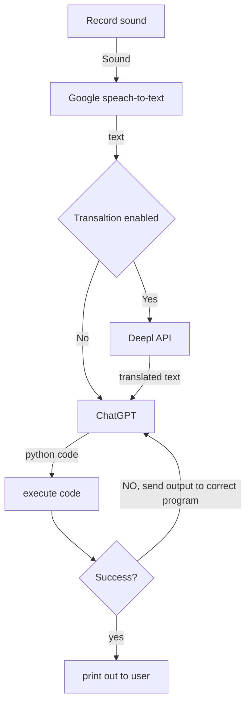

# butler-gpt

ChatGpt helper.

Bot that can do stuff on your computer.

Basic idea is as follows:

ChatGPT is primed with instructions to convert commands to code, and to correct code when output is given to it.
Code also includes print statement at the end, so we can easily check if it went through. If code goes through, we consider it a success,
if not - we send output back to ChatGPT for corrections. If everything goes ok, we return results to user.
That of course lefts out entire category of errors, when program runs but does not do the thing that was expected to do.
So, and I cannot stress this enough, this helper can royally screw the machine it is running on.

